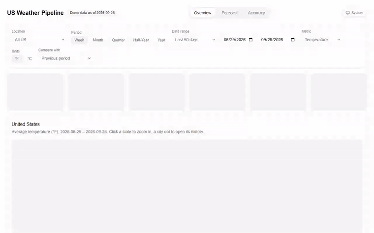
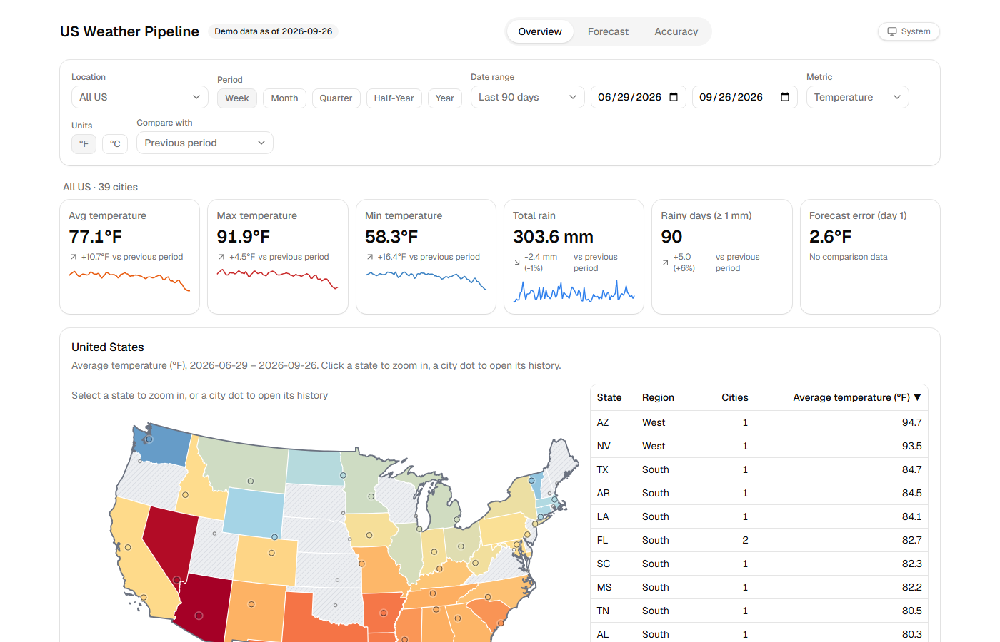
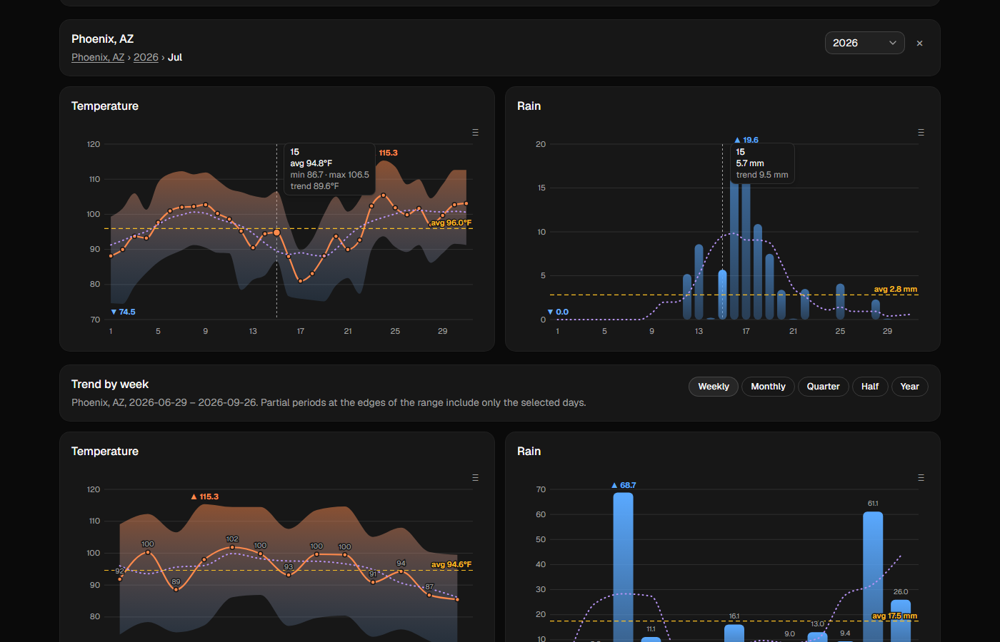
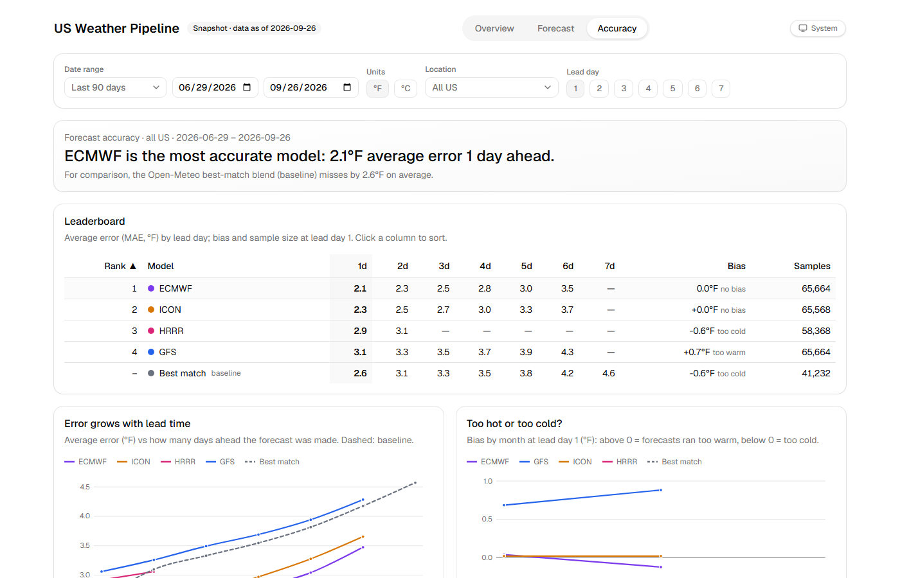
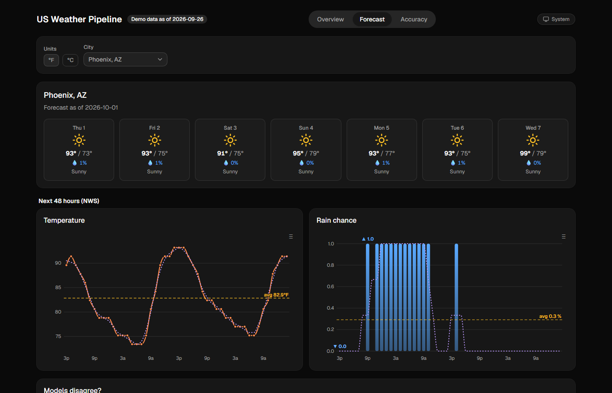
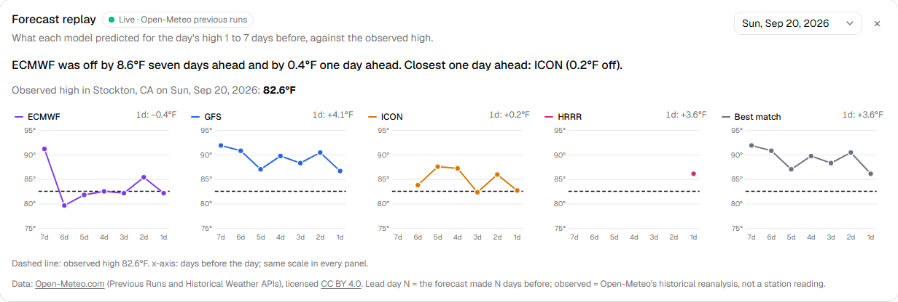
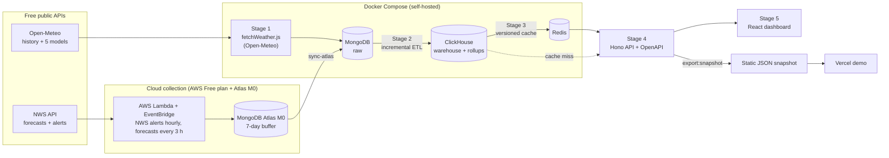
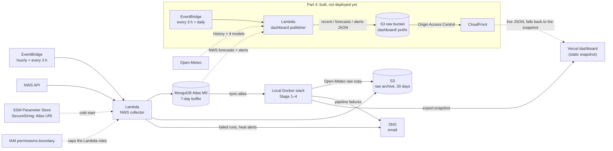

# US Weather Pipeline

**Which weather model forecasts the US best? An end-to-end data pipeline and dashboard that collects forecasts from 5 models, scores them against what actually happened, and explains 3 years of weather for 53 US cities, on a $0 budget.**

[](https://github.com/dangkhoa241/us-weather-pipeline/actions/workflows/ci.yml)

[](LICENSE)
[](https://us-weather-pipeline.vercel.app)

### ▶ [Live demo: us-weather-pipeline.vercel.app](https://us-weather-pipeline.vercel.app)

The demo is a static data snapshot (badge "Snapshot · data as of …"). Data collection already runs on AWS. Automatic
updates for the dashboard (S3 + CloudFront, Part 4) are built but not deployed yet.



## Key finding

> **ECMWF is the most accurate model: 2.1 °F average error one day ahead.**

| Model (lead day 1) | Average error | Bias |
|---|---|---|
| 🥇 ECMWF | **2.1 °F** | none |
| 🥈 ICON | 2.3 °F | none |
| 🥉 HRRR | 2.9 °F | 0.6 °F too cold |
| GFS | 3.1 °F | 0.7 °F too warm |
| *Best-match blend (baseline)* | *2.6 °F* | *0.6 °F too cold* |

Error grows by about 0.25 °F for each extra day of lead time. The scores compare hourly forecasts with observed temperatures: about 65,000 pairs per model, from 20 cities, 2026-06-29 to 2026-09-26. Method: [How this is measured](#how-accuracy-is-measured).

## Design decisions

I designed the product and its features. Claude Code implemented them under my direction, using a compare-3-implementations-and-review process from my earlier ExpenseTracker project.

- **City drill-down:** click a city → 12 months → click a month → daily values, with a year selector.
- **Map and state table side by side, linked:** hovering or clicking one highlights the other.
- **Twin Temperature + Rain charts** with a moving average, an average line and ▲ max / ▼ min markers (inspired by BI dashboards I built at FPT Telecom).
- **Charts appear only when you click a city.** The default is an "All US" overview.
- **Period filters:** Week / Month / Quarter / Half-Year / Year.
- **One city per state,** so the whole map is covered.
- **Forecast-accuracy leaderboard** to answer "which weather model is most accurate?".
- **$0 budget:** everything runs on free tiers.
- **Compare & review:** 3 implementations per key feature, and a security review every stage.

## Features

| | |
|---|---|
|  |  |
| **Overview:** a map with 53 city dots and a linked, sortable state table, below All US KPIs compared with the previous period. | **City history (dark mode):** years → months → days, twin charts with a synced crosshair, and PNG/CSV download. |
|  |  |
| **Accuracy:** the leaderboard by lead day, error vs lead time, bias by month, the best model per state and the biggest misses. | **Forecast:** 7-day NWS cards, the next 48 hours, a "Models disagree?" spread chart and active NWS alerts. |

Also included:
- Every filter is in the URL, so links can be shared and Back/Forward work.
- Keyboard-accessible map and charts.
- Light and dark themes that follow the system.
- Missing data always shows as a gap, never as 0.

### Forecast replay



In a city's day view, **Replay forecasts** shows what ECMWF, GFS, ICON, HRRR and best match predicted for that day's
high 1 to 7 days before, against the observed high, with a plain-words summary line.
- **Live from the browser:** it calls Open-Meteo's Previous Runs and archive APIs directly, with no backend, Docker
  or AWS. Each day shown costs 2 requests, and each day is fetched once per page load.
- **Fallback:** if Open-Meteo can't be reached, it says "Live data unavailable" and shows a bundled 3-city sample
  (2.9 KB).
- **Design:** small multiples, chosen over a single line chart and a min–max band in
  [forecast-replay.md](docs/analysis/forecast-replay.md).

## Architecture



- **Stage 1** collects raw data with retries, rate limits and a weighted Open-Meteo call budget. NWS forecasts and alerts are collected in the cloud (Lambda → Atlas) and copied home by `sync-atlas`, so the laptop can be off.
- **Stage 2** loads only new rows (watermark) into `ReplacingMergeTree` tables. Daily and monthly rollups use each city's local time.
- **Stage 3** puts a versioned cache in front of the warehouse. The landing page's queries are pre-warmed after each load.
- **Stage 4** serves the API: one Zod definition per route drives validation, the OpenAPI docs and the dashboard's TypeScript types.
- **Stage 5** is the dashboard: React + TypeScript, with hand-rolled d3 for the map and charts.

## AWS deployment

Deployed on AWS: one SAM stack (`infra/template.yaml`) in us-east-2 on the AWS **Free plan**. It collects NWS data
in the cloud, so the laptop can be off. The local Docker stack stays the primary system: AWS holds only the
collector, alert emails and a 30-day raw archive. Setup and policies: [docs/SETUP_AWS.md](docs/SETUP_AWS.md).



| Service | Job | Free-tier allowance | Our use (measured / expected per month) |
|---|---|---|---|
| Lambda `weather-pipeline-nws-collector` | NWS alerts (hourly) and forecasts (every 3 h) → Atlas + S3 | 1 M requests, 400,000 GB-s | ~960 runs, ~6,800 GB-s (2%); 256 MB; alerts ~8 s, forecasts ~88 s, 168 MB peak |
| EventBridge | 2 schedule rules | scheduled rules free | 32 invocations / day |
| S3 raw archive | gzipped raw responses, deleted after 30 days | 5 GB, 2,000 PUT, 20,000 GET (12 months) | ~660 PUTs (33%; ≤ 806 = 40% by hard caps: Lambda 16 / day, local 10 / day); ~175 MB held by the 30-day rule |
| SNS | email on failed runs and new heat alerts | 1 M publishes, 1,000 emails | < 150 emails |
| SSM Parameter Store | Atlas URI as a SecureString (AWS-managed key) | standard parameters free | 1 parameter, read at cold start |
| CloudWatch Logs | Lambda logs, 7-day retention | 5 GB | < 50 MB |
| CloudFormation / SAM, IAM | infrastructure as code, users, roles, boundary | free | 1 stack |

**Why S3 + CloudFront instead of an API (Part 4, built, not deployed yet).** The dashboard already reads static JSON
files. A scheduled Lambda will rewrite those files in S3 and CloudFront will serve them, so no code runs per request:
there is no public API to rate-limit or secure, and no cold start. The first deploy is waiting for AWS to verify the
account for CloudFront. The comparison with a DynamoDB + Lambda Function URL API
is in [docs/analysis/live-dashboard.md](docs/analysis/live-dashboard.md).

| Adapter interface | Local implementation | AWS |
|---|---|---|
| `Notifier` | console | **SNS** (deployed) |
| `RawStore` | MongoDB | MongoDB + **S3 archive copy** (deployed) |
| `Scheduler` | node-cron | **EventBridge** for NWS collection (deployed) |
| `CacheStore` | Redis | not planned (Part 4 serves static files instead) |

## By the numbers

| | |
|---|---|
| Cities | **53** (the largest city in each state, plus DC and Stockton) |
| Rows loaded | **1.04 M** hourly observations, **1.82 M** forecast snapshots |
| Cache, warm p95 | **35.4 → 2.9 ms** (12× faster); cold p95 62.2 → 32.3 ms |
| API | ~1,600 req/s, p95 12.7 ms, 0 errors; 22/22 security probe checks |
| Tests | **107** Vitest tests (33 backend + 74 dashboard) and 18 checks on the demo build |
| Demo snapshot | 2.9 MB (418 KB gzipped) for 53 cities × 3+ years |
| AWS Lambda | 256 MB; alerts run ~8 s, forecast run ~88 s (106 NWS requests, ~9,000 rows, 168 MB peak); ~960 runs / month ≈ 2% of the free GB-s |
| AWS S3 | ~660 PUTs / month (33% of 2,000; ≤ 40% by hard caps); ~175 MB stored with 30-day expiry (3.5% of 5 GB) |
| AWS bill | **$0** (Free plan) |
| Budget | **$0** |

## Built with Claude Code: compare & review

For each key feature, Claude Code built **3 implementations** on separate branches (`feature/<name>-v1..v3`). I compared them with measured numbers, merged the winner and fixed the security issues the comparison surfaced.

| Feature | Options compared | Winner | Why | Security issues caught | Report |
|---|---|---|---|---|---|
| Stage 3 caching | No cache · cache-aside · pre-warm + cache-aside | **Combined** (cache-aside + small pre-warm list + single-flight) | 12× faster warm p95 with the least code; landing page fast after each load | A Redis outage made requests hang (now fail fast); unbounded cache memory (now `maxmemory` + LRU) | [caching.md](docs/analysis/caching.md) |
| Stage 4 API layer | Express + Zod · Fastify + JSON Schema · Hono + zod-openapi | **Hono** | Same throughput; lowest memory, fewest dependencies, one definition per route | NoSQL operator injection via `?stage[$ne]=x` (qs parser); unknown params ignored or silently dropped; no CSP by default; Swagger UI loaded from a CDN without a pinned version | [api-layer.md](docs/analysis/api-layer.md) |
| Stage 5 US map | ECharts · react-simple-maps · d3-geo | **d3-geo** | Smallest (+47 KB), fastest, every state keyboard-accessible | ECharts tooltip built HTML strings from data (XSS risk); test hooks on `window` | [map-drilldown.md](docs/analysis/map-drilldown.md) |
| Stage 5 drill-down chart | ECharts · Recharts · d3-scale/d3-shape | **d3** | +10 KB vs +108 KB (Recharts), 185 ms render, full keyboard drill-down | HTML tooltip formatters avoided; the `window` hook was not merged; Recharts' larger dependency tree | [drilldown-chart.md](docs/analysis/drilldown-chart.md) |
| Stage 5 forecast replay chart | One line per model · small multiples · min–max band with lines | **Small multiples** | Every model readable (best match duplicates GFS, which hides a line in the others); +0.6 KB | Static-server path guard accepted a sibling folder (`dist-old`); bundled sample's model ids not checked against the known models | [forecast-replay.md](docs/analysis/forecast-replay.md) |

## Security

- **SQL injection fixed:** a legacy endpoint pasted `?city=` into SQL with quote doubling, which a backslash bypasses in ClickHouse. All SQL now uses ClickHouse `query_params` (`{name:Type}`), and no user input is ever interpolated.
- **NoSQL operator injection blocked:** query strings are parsed as plain strings, and every route has a `.strict()` Zod schema, so `?x[$ne]=` and unknown parameters get a 400.
- **CSP everywhere:**
  - The API sends `default-src 'none'`.
  - The `/docs` page loads a pinned Swagger UI version.
  - The demo runs under a strict CSP with no `eval` (Zod runs "jitless").
  - React escapes all data, and nothing uses `dangerouslySetInnerHTML`.
  - `connect-src` lists only the two exact Open-Meteo hosts the forecast replay calls (no wildcards). Those requests
    send no cookies and no referrer.
  - `style-src 'unsafe-inline'` is kept on purpose. The SVG charts and tooltips set theme colors (CSS variables) and
    positions through inline `style` attributes. A nonce can't cover `style` attributes, and hashing computed values
    doesn't work. Scripts stay `'self'`-only, so an inline style can't run code.
- **Secret scanning:** `npm run check:secrets` must pass before every push. It checks:
  - the history and the working tree for secrets;
  - that `.env` is not tracked;
  - that every commit uses the noreply email;
  - that no untracked files are left over.
- **Least privilege:** databases and the API listen on `127.0.0.1`. Workflows have `contents: read`, secrets are set only on the steps that need them, and `npm ci --ignore-scripts` runs in CI.
- **Rate limiting and CORS** on the API, plus a 22-check black-box security probe (`npm run probe:api`).
- **AWS:**
  - two least-privilege IAM users: `weather-dev` deploys (CLI only, no console) and `weather-runtime` can only publish to SNS and write archive objects;
  - every role the stack creates must carry a **permissions boundary**, so a leaked deploy key can't create an admin role;
  - the Atlas URI is an **SSM SecureString** (AWS-managed key), never in code or environment variables;
  - the S3 bucket is private: account-wide **Block Public Access**, ACLs disabled, SSE-S3, a bucket policy that denies non-HTTPS requests (Part 4's CloudFront will read it only through **Origin Access Control**);
  - keys live only in `~/.aws`, rotated every 90 days; `check:secrets` fails on AWS key IDs, secret keys and session tokens.
- **A `/security-review` at the end of every stage**, with low findings logged in the [roadmap](docs/ROADMAP.md#known-limitations).

## Tech stack

| Layer | Tools |
|---|---|
| Collection | Node.js 18+ (ESM), NWS API, Open-Meteo, node-cron, AWS Lambda + EventBridge |
| Storage | MongoDB (raw), ClickHouse (warehouse), Redis (cache), MongoDB Atlas M0 (cloud buffer) |
| API | Hono, @hono/zod-openapi, Zod, Swagger UI |
| Dashboard | React 19, TypeScript, Vite, d3-geo / d3-scale / d3-shape, ECharts (sparklines), TanStack Query + Table, Zustand, Tailwind CSS, shadcn/ui |
| Quality | Vitest, React Testing Library, Playwright (demo checks, GIF), Docker Compose |
| Cloud (AWS) | Lambda, EventBridge, S3, SNS, SSM Parameter Store, IAM, CloudWatch Logs, CloudFormation / SAM (CloudFront: built, not deployed yet) |
| Hosting | Vercel (static demo), GitHub Actions CI |

Each storage layer sits behind an adapter (`RawStore`, `CacheStore`, `Warehouse`, `Scheduler`, `Notifier`). A cloud service such as BigQuery or DynamoDB can be added as one new file.

## Run it locally

Requirements: Node.js 18+ and Docker Desktop.

```bash
npm install && (cd dashboard && npm install)
cp .env.example .env              # set NWS_USER_AGENT to your contact
docker compose up -d              # MongoDB, ClickHouse, Redis + fetcher (collects on a schedule)
npm run seed:locations            # 53 cities + NWS grid points

npm run fetch                     # Stage 1: APIs → MongoDB
npm run etl:clickhouse            # Stage 2: MongoDB → ClickHouse
npm run etl:redis                 # Stage 3: ClickHouse → Redis
npm start                         # Stage 4: API on http://127.0.0.1:3000 (docs at /docs)
cd dashboard && npm run dev       # Stage 5: dashboard on http://localhost:5173

npm test                          # backend tests (no Docker needed)
```

More: [cloud collection setup](docs/SETUP_CLOUD_COLLECTION.md), [Vercel demo](docs/DEPLOY_VERCEL.md), [roadmap](docs/ROADMAP.md).

## $0 budget: free-tier design

| Service | Free limit | Our use |
|---|---|---|
| Open-Meteo | 10,000 weighted calls / day (non-commercial) | ~2,400 / day, capped at 6,000 by our own budget ledger |
| Open-Meteo from the browser (forecast replay) | Same limit, counted per visitor's IP | ~5 weighted calls per day replayed, only when a visitor asks |
| NWS API | No published quota | ~106 requests / 3 h |
| MongoDB Atlas M0 | 512 MB | ~370 MB with a 7-day retention |
| Vercel Hobby | 100 GB transfer / month | ~0.5 MB per visit (static snapshot) |
| GitHub Actions | Free on public repos | CI (+ manual collection fallback) |
| MongoDB, ClickHouse, Redis | Self-hosted in Docker | Local disk only |

| AWS (Lambda, S3, SNS, SSM, EventBridge, CloudWatch Logs) | Free plan + always-free allowances | ≤ 2% of Lambda, ~33% of S3 PUTs (table above) |

**Cost so far: $0.** The AWS account is on the **Free plan** (until 2027-04-02): usage above the always-free
allowances is paid from sign-up credits, never billed to a card. A **zero-spend budget alert** emails on any charge,
a cost guard in [CLAUDE.md](CLAUDE.md) bans paid services (NAT Gateway, EC2, RDS, …), and `npm run aws:teardown`
deletes the whole stack.

None of these needs a credit card. Every external service has its limits and overflow behavior documented in the [roadmap](docs/ROADMAP.md).

## How accuracy is measured

- **Error (MAE):** each hourly temperature forecast vs the temperature observed at that hour, averaged without the sign.
- **Bias:** the average of forecast − observed. Positive means the model runs too warm.
- **Lead day:** how many days before the forecast hour the model run was issued.
- **Converting to °F:** errors and biases are ×1.8, with no +32.
- **Baseline:** best-match is a lead-day-only baseline (its issue time is approximate). It is listed but not ranked, and left out of "biggest misses". Legacy snapshots are excluded.

## Known limitations

- Model accuracy covers ~Jul–Aug 2026 for the original 20 cities so far, because the backfill is still catching up. NWS joins the leaderboard once its forecasts can be matched with observations (~5-day lag).
- The 14 newest cities are still loading their 3-year history (they show as hollow dots on the map).
- The demo is a frozen snapshot. Some accuracy views exist only for all US over the last 90 days.
- Collection of Open-Meteo forecasts needs the local Docker stack running. NWS is collected in the cloud.

The full list is in the [roadmap](docs/ROADMAP.md#known-limitations).

## Credits

This project started from [Weather-Database-System](https://github.com/iDarshanaPatil/Weather-Database-System), a basic course project I built with Darshana Patil, Manu Mathew Jiss and Shradha Pujari at University of the Pacific. This version is a substantial rewrite and extension: multi-source US forecasts, forecast-accuracy analysis, a new API, caching, cloud collection and a React dashboard.

Weather data: [National Weather Service](https://www.weather.gov/documentation/services-web-api) and [Open-Meteo](https://open-meteo.com/) (CC BY 4.0). Map data: [us-atlas](https://github.com/topojson/us-atlas).

## License

[MIT](LICENSE) © 2026 Khoa Tran
